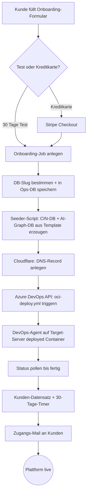

# Onboarding-Automatisierung — Gesamtsystem

> Status: Vorschlag / Draft | Stand: 2026-07-22
> Canvas: [[Deployment.canvas]]
> Kontext: [[OperationsCenter-Design]] · [[Operations Brainstorming.canvas]]
> Repo: `C:\Dev\cin-operations-center`

## Zielbild

Ein Neukunde füllt **ein Formular** aus — der Rest läuft **vollautomatisch**: Datenbanken anlegen, DNS setzen, Container deployen, Plattform startklar. Vom Klick bis zur laufenden Kunden-Instanz greift niemand mehr manuell ein. Zwei Einstiege: **kostenloser 30-Tage-Test** oder **direkt Kreditkarte hinterlegen**. Beide Wege erzeugen dieselbe echte Produktions-Instanz.

Das **OPS-Center ist der Orchestrator**: es steuert die Kette selbst und ruft die externen Systeme (PostgreSQL, Cloudflare, Azure DevOps) aktiv an.

---

## Gesamtablauf (End-to-End)



Jeder Schritt schreibt seinen Fortschritt in den **Onboarding-Job** (`onboardingJobs.stepDetails` / `currentStep`), sodass der Ablauf im OPS-Center-UI live sichtbar ist und bei Fehler an der richtigen Stelle wieder aufsetzt.

---

## Auslöser & Kundenwege

| Weg | Ablauf | Billing |
|---|---|---|
| **Kostenloser Test** | Formular → sofort volle Produktions-Instanz | 30 Tage gratis, danach KK nötig |
| **Direkt Kreditkarte** | Formular → Stripe Checkout → Provisionierung | Sofort zahlungsbereit, Test-Zeit läuft parallel |

- Beide Wege führen zu **identischer, dedizierter Infrastruktur** (eigene DBs + eigener Container + eigene URL). Kein separates „Demo"-Konstrukt.
- Der Kunde arbeitet vom ersten Tag an mit seiner echten Produktions-Datenbank.

---

## Architektur-Prinzipien (entschieden)

| Entscheidung | Wahl | Begründung |
|---|---|---|
| Orchestrierung | OPS-Center ruft externe Systeme selbst | Volle Kontrolle, Fortschritt sichtbar, Template-Wahl im OPS |
| Container-Deploy | Immer über **Azure DevOps Pipeline** | Einheitliches Muster; self-hosted Agent auf Target-Server deployed lokal |
| DB-Anlage | **Seeder-Script** aus Template-DB | Sauberes Handling (Umlaute, Verschlüsselung), reproduzierbar |
| DB-Aufteilung | **CIN-DB und AI-Graph-DB getrennt** | AI-Graph ist aus CIN regenerierbar → Re-Index ohne Risiko an der Quelle; Last-Isolation; getrenntes Backup |
| DNS | **Cloudflare-API** direkt aus OPS-Center | Besser steuerbar als über Pipeline |
| DB-Identität | **DB-Slug ≠ URL** (entkoppelt) | URL-Wechsel darf **nie** eine DB-Migration auslösen |
| Templates | Gepflegte „Vorlage-Plattformen" | z.B. `innovationmanagement.template.cin.swiss`, `swissgov.template.cin.swiss` |

---

## Provisionierung im Detail

| # | Schritt | System | Wie |
|---|---|---|---|
| 1 | Onboarding-Job anlegen | Ops-DB | `onboardingJobs` (status, currentStep, stepDetails) |
| 2 | DB-Slug festlegen | Ops-DB | Stabile Identität, Default-Basis `crossinnovation`, einmalig erzeugt + gespeichert |
| 3 | Datenbanken erzeugen | PostgreSQL | Seeder-Script: **CIN-DB** (`cin-<slug>`, aus Template) + **AI-Graph-DB** (`cin-graph-<slug>`), getrennt |
| 4 | DNS anlegen | Cloudflare | API-Call: `<url>.cin.swiss` → Target-Server |
| 5 | Container deployen | Azure DevOps | `oci-deploy.yml` via DevOps-API triggern (Parameter: Slug, URL, DB-Connection, Image-Tag) |
| 6 | Deploy ausführen | Target-Server | Self-hosted DevOps-Agent nimmt Job an, fährt Container hoch |
| 7 | Status verfolgen | Azure DevOps | Pipeline-Run pollen bis `success`/`failed` |
| 8 | Kunde finalisieren | Ops-DB | `customers`-Datensatz, Tier, 30-Tage-Timer |
| 9 | Zugang senden | E-Mail (Graph) | Zugangs-Mail mit URL + Erst-Login |

> **Build-Pipeline** (Azure DevOps `definitionId=18`) baut das OCI-Image. **`oci-deploy.yml`** deployed das Image als Kunden-Container. OPS-Center triggert nur und pollt.

---

## Namens- & DB-Konzept

Pro Kunde entstehen **zwei getrennte Datenbanken** (unterschiedliche Rollen):

| DB | Muster (Bsp. Slug „ipg") | Rolle |
|---|---|---|
| **CIN-DB** | `cin-<slug>` → `cin-ipg` | Quelle der Wahrheit: Content, Ratings, User (aus Template geseedet) |
| **AI-Graph-DB** | `cin-graph-<slug>` → `cin-graph-ipg` | GraphRAG-Daten (füttert `trendradar.graph`), aus CIN regenerierbar |

- **Getrennt gehalten:** Der AI-Graph ist ein Derivat der CIN-DB → jederzeit neu aufbaubar, ohne die Produktivdaten zu gefährden. Last-Isolation + getrenntes Backup.
- **DB-Slug** ist eine **Variable** (Default-Basis `crossinnovation`), wird **einmal am Start** erzeugt und in der Ops-DB gespeichert.
- **URL ist getrennt** vom Slug: Ändert der Kunde später seine URL, bleiben die DB-Namen unverändert — keine Migration nötig.
- **Ein Klick:** Der Orchestrator erzeugt beim Onboarding beide DBs im selben Job; beim Löschen fallen beide zusammen weg.

---

## Deprovisionierung / Lifecycle-Timer

Eigener, kleinerer Ablauf (Umkehrung der Provisionierung):

```
Tag 0 ─── 30 Tage gratis ───▶ Tag 30: Kreditkarte muss hinterlegt sein
                                   │ keine KK
                                   ▼
                             Grace-Periode bis Tag 40
                                   │
                                   ▼
                     Tag 40: ALLES automatisch gelöscht
        (CIN-DB + AI-Graph-DB · Container via Pipeline · Cloudflare-DNS)
```

- **Tag 0–30:** kostenlos.
- **Tag 30:** ohne hinterlegte Kreditkarte → Grace-Periode.
- **Tag 40:** vollautomatische Löschung — CIN-DB + AI-Graph-DB droppen, Container-Removal-Pipeline triggern, DNS-Record entfernen.

---

## Komponenten im OPS-Center (was gebaut wird)

Bezogen auf `cin-operations-center` (Next.js 16, Drizzle, PostgreSQL):

| Komponente | Status heute | Zu tun |
|---|---|---|
| Azure-DevOps-Client `src/lib/providers/devops/azure.ts` | ✅ list/trigger/poll | Parameter-Übergabe an `oci-deploy.yml` ergänzen |
| **Cloudflare-Provider** `src/lib/providers/cloudflare/` | ❌ fehlt | Neu: DNS-Record anlegen/löschen |
| **DB-Seeder** (Script) | ❌ fehlt | Neu: Template → 3 Kunden-DBs |
| **Onboarding-Orchestrator** `src/modules/onboarding/` | ⚠️ nur Job-Tracking | Schritte 2–9 als Ablauf verdrahten |
| Onboarding-API `/api/onboarding/start` | ⚠️ vorhanden | An Orchestrator anschliessen |
| **Onboarding-Formular** | ❌ fehlt | Öffentliches Formular (Test / KK) |
| Stripe-Checkout | ⚠️ Schema vorhanden | Checkout-Session für KK-Weg |
| Zugangs-Mail (Graph) | ✅ Mailsystem da | Template + Versand |
| **Deprovisionierungs-Job** | ❌ fehlt | Timer 30/40 + Löschkette |

---

## Orchestrierung — Ausführungsmodell (Empfehlung)

Die Provisionierung dauert (DB-Seed + Pipeline-Deploy) mehrere Minuten. Wie ausführen?

- **A) Synchron im Request** — einfach, aber blockiert und bricht bei Timeout ab. ❌
- **B ⭐ Empfohlen — Hintergrund-Job mit Status** — `/api/onboarding/start` legt Job an und kehrt sofort zurück; ein Worker arbeitet die Schritte ab und schreibt Fortschritt in `onboardingJobs.stepDetails`. UI zeigt Live-Fortschritt, Wiederaufsetzen bei Fehler am letzten Schritt.
- **C) Externe Queue** (z.B. Redis/BullMQ) — mächtiger, aber Overkill für aktuelles Volumen. Später möglich. ⚠️

**Empfehlung: B** — passt zum bestehenden `onboardingJobs`-Schema und braucht keine neue Infrastruktur.

---

## Ops-DB — Erweiterungen (Vorschlag)

Pro Kunde/Job zusätzlich festhalten:

- `db_slug` — stabile DB-Identität (getrennt von URL)
- `url` — aktuelle Kunden-URL (frei änderbar)
- `template` — gewählte Vorlage (z.B. `innovationmanagement`, `swissgov`)
- `db_names` — die 3 erzeugten DB-Namen
- `pipeline_run_id` — Azure-DevOps-Run zur Status-Verfolgung
- `trial_ends_at` / `delete_at` — Lifecycle-Timer (Tag 30 / Tag 40)

---

## Schrittweiser Rollout (step by step)

| Phase | Inhalt | Ergebnis |
|---|---|---|
| **1** | Orchestrator-Gerüst + Ops-DB-Felder, jeder Schritt zunächst als **Dry-Run/Mock** | Ablauf sichtbar, nichts Reales angefasst |
| **2** | **DB-Seeder** (Template → 3 DBs) | Kunden-DBs reproduzierbar erzeugbar |
| **3** | **Cloudflare-DNS** anlegen/löschen | Subdomain automatisch |
| **4** | **Azure-DevOps** `oci-deploy.yml` mit Parametern + Polling | Container läuft |
| **5** | **Onboarding-Formular** + Test-/KK-Weg (Stripe) + Zugangs-Mail | Kompletter Self-Service |
| **6** | **Deprovisionierung** (Timer 30/40 + Löschkette) | Lifecycle geschlossen |

---

## Offene Punkte

1. **AI-Graph-DB:** Wird sie beim Onboarding leer erzeugt und danach aus dem CIN-Content aufgebaut (Ingest via `trendradar.graph`), oder gibt es auch dafür ein Template? Und: eigene Postgres-Instanz/Extension (pgvector/Neo4j/AGE) oder dieselbe Postgres wie CIN?
2. **`oci-deploy.yml`:** Welche Parameter erwartet die Pipeline genau (Slug, URL, DB-Connection, Image-Tag, Port)?
3. **Cloudflare:** Zone/Account, DNS-Ziel (A-Record IP oder CNAME auf welchen Host)?
4. **Formular-Ort:** Marketing-Seite oder OPS-Center-Onboarding-Seite?
5. **Slug-Generierung:** Regeln + Kollisionsprüfung; Bedeutung Default-Basis `crossinnovation`.
6. **Test-Ende ohne KK:** Sperren an Tag 30, oder erst Löschung an Tag 40 (kein Sperr-Zwischenschritt)?
7. **Image-Tag/Version:** Welche Version wird pro Deploy gewählt (immer latest Release?).
8. **Zugangs-Mail:** Inhalt/Template + Erst-Login-Verfahren.

---

## Referenzen

- Deployment-Diagramm: [[Deployment.canvas]]
- Gesamt-Design OPS-Center: [[OperationsCenter-Design]]
- Brainstorming: [[Operations Brainstorming.canvas]]
